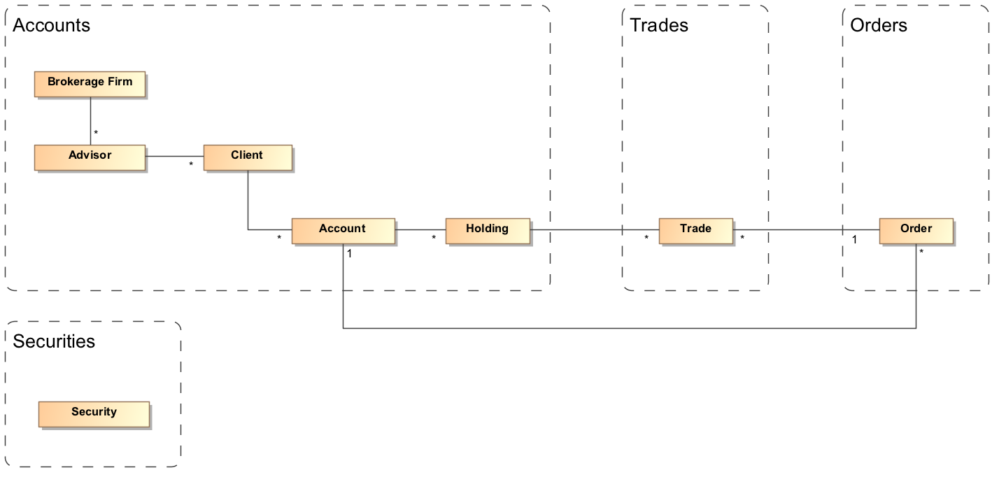
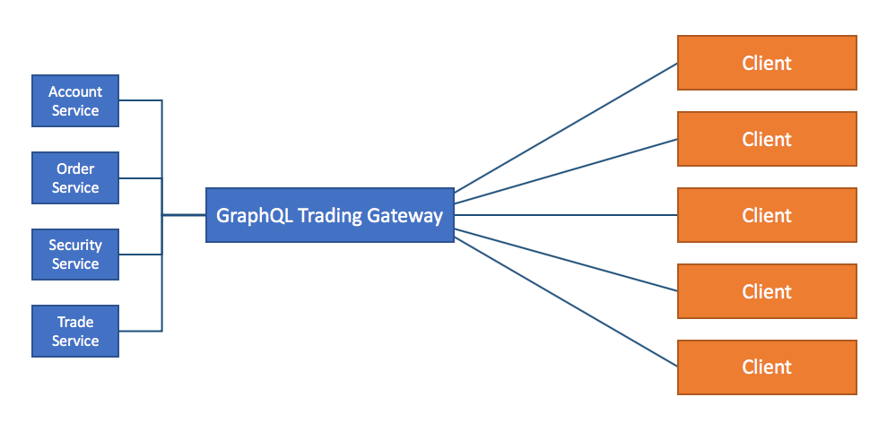

GraphQL Trading Platform
========================
Most GraphQL tutorials use simplistic examples to demonstrate its capabilities. Unfortunately, when we start building real applications, we run into complexities that these tutorials do not address. This repo demonstrates the use of GraphQL to implement a rich domain with multiple entities and relationships. We use the [Apollo GraphQL](https://www.apollographql.com/) tools and libraries for this implementation.

1. Our example uses a simplified bond trading domain containing multiple entities and relationships.
2. We use 4 REST services to present aggregated account and trade information to front-end clients.

Here's the domain model of our trading domain:

Here's the high-level architecture of our implementation:

As you can see, we have implemented a GraphQL gateway backed by 4 independent REST services.
