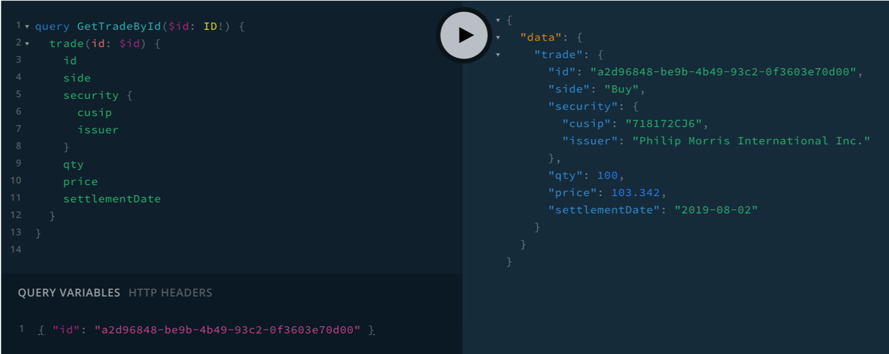

# GraphQL Trading Gateway

GraphQL based gateway for presenting aggregated account and trade information to
front-end clients.

## Dev Build

1. Install the required dependencies:

```bash
yarn
```

2. Start the 4 REST services in 4 different shells:

```bash
yarn start-db-accounts
yarn start-db-orders
yarn start-db-securities
yarn start-db-trades
```

3. Start the GraphQL gateway:

```bash
yarn dev
```

Now point your browser to http://localhost:4000/. You will see GraphQL
Playground, an interactive development environment to test the GraphQL API.

Try the following query:

```
query GetOrderById($id: ID!) {
  order(id: $id) {
    id
    side
    security {
      cusip
      issuer
    }
    qty
    qtyFilled
    price
    settlementDate
    status
    trades {
      id
      qty
      price
    }
  }
}

```

Make sure to provide a value for the `id` query variable. The following should
work:

```
{ "id": "8822d4f0-1cab-4a5e-8b4e-a03e89bc03f9" }
```

Here's the resulting screen:



## Prod Build

```bash
yarn
yarn build
yarn start
```
